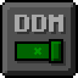

RU

    
    <h1 align="center">Default Dark Mode: Further</h1>
    <h2 align="center">Дополнение к набору ресурсов «Default Dark Mode: Expansion» для Minecraft: Java Edition</h2>

    Default Dark Mode: Further это дополнение к Default Dark Mode: Expansion. Оно добавляет и исправляет около 20 модов. Рекомендуется использовать все наборы ресурсов вместе для получения наилучшего опыта использования Default Dark Mode.

    
    <h1 align="center">Default Dark Mode: Further</h1>
    <h2 align="center">An add-on for the Default Dark Mode: Expansion resource pack for Minecraft: Java Edition</h2>

    Default Dark Mode: Further is an add-on of Default Dark Mode: Expansion. It adds/fixes about 20 mods. It's recommended to use all resource packs together for the best Default Dark Mode experience possible.

